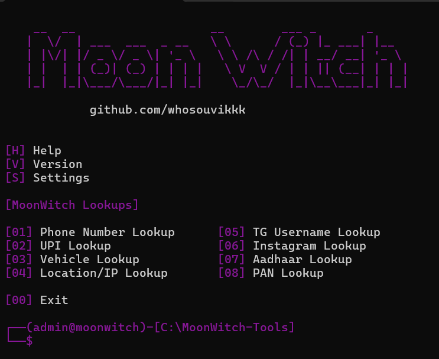

# MoonWitch Tools 🌙

MoonWitch is a streamlined, terminal-based OSINT (Open Source Intelligence) framework designed for rapid data lookups. It provides a clean, purple-themed command-line interface to query external APIs for information gathering.

## Preview



## Features

- **Phone Number Lookup**
- **UPI ID Lookup**
- **Vehicle Registration Lookup**
- **Location/IP Tracking**
- **Social Media Lookups** (Telegram, Instagram)
- **Document Verification** (Aadhaar, PAN)

---

## Prerequisites

- Python 3.x
- `requests` library
- `colorama` library

## Installation & Configuration

1. **Clone the repository:**
   ```bash
   git clone https://github.com/yourusername/MoonWitch-Tools.git
   cd MoonWitch-Tools
   ```

2. **Install the required packages:**
   ```bash
   pip install -r requirements.txt
   ```

3. **Configure API Access:**
   To use this tool, you must provide your own API URL and API Key. 
   - Open `moonwitch.py` in a text editor.
   - Locate the configuration section at the top:
     ```python
     API_URL = "https://your-api-endpoint.com/api/v1/"
     API_KEY = "YOUR_API_KEY_HERE"
     ```
   - **Need an API Key?** If you do not have an API key, you can join and contact me for assistance: [https://t.me/moonwitchservices](https://t.me/moonwitchservices)

## Usage

Run the script from your terminal:
```bash
python moonwitch.py
```
Navigate the menu using the numbered options. The tool will prompt you for the specific number or ID required for each lookup.

---

## Disclaimer

This tool is intended for educational and authorized investigative purposes only. The user assumes all responsibility for legal compliance when using this software to query data. The developers assume no liability for misuse.
